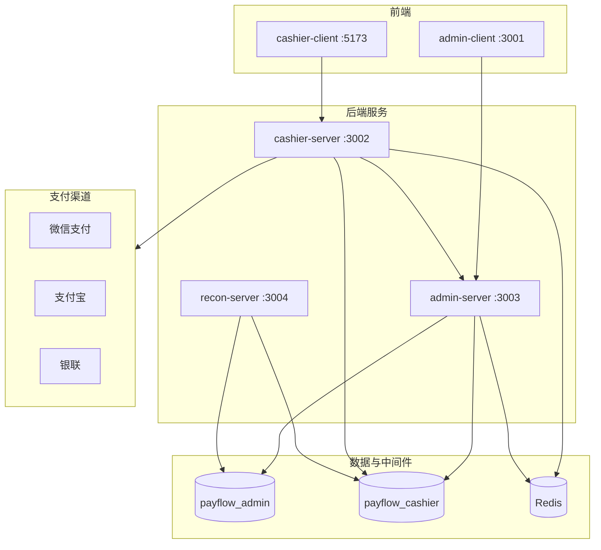

# PonyFlux Pay

轻量级支付网关与运营平台，面向商户接入、渠道路由、收银台、退款与对账等完整支付链路。后端 Java 17 + Spring Boot 3，前端 Vue 3 + TypeScript，采用 Strategy Pattern 扩展微信 / 支付宝 / 银联等渠道。

## 特性

- **多渠道支付**：微信（Native / H5 / App / JSAPI 等）、支付宝、银联，Strategy 插件化接入
- **双库设计**：`payflow_admin`（配置与运营）+ `payflow_cashier`（交易流水），职责清晰
- **商户收银台**：PC / H5 自适应，支持简 / 繁 / 英三语展示
- **管理后台**：商户、渠道、路由、RBAC、费率、进件、对账差异工单
- **对账引擎**：账单下载 → 解析 → 比对 → 差异标注（独立 recon-server）
- **安全机制**：Admin JWT、商户 HMAC-SHA256 签名、支付幂等锁、商户数据隔离

## 技术栈

| 层级 | 技术 |
|------|------|
| 后端 | Java 17、Spring Boot 3.2、MyBatis-Plus、Redis、RocketMQ、XXL-Job |
| 前端 | Vue 3.4、TypeScript、Vite 5、TailwindCSS、Element Plus、Pinia |
| 数据 | MySQL 8、Redis 7 |
| 构建 | Maven 多模块、npm |

## 架构



### 模块说明

| 模块 | 说明 |
|------|------|
| `payflow-common` | 公共组件：`BizException`、AES 加解密、Redis 常量等 |
| `payflow-payment-core` | 支付 SPI：`PayStrategy`、`PayMethod`、统一 DTO |
| `payflow-payment-channels/*` | 各渠道实现（微信 / 支付宝 / 银联） |
| `payflow-cashier-server` | 商户侧：下单、支付、退款、回调 |
| `payflow-admin-server` | 运营侧：配置、报表、对账 UI、RBAC |
| `payflow-recon-server` | 对账批处理引擎 |
| `payflow-sdk-java` | 商户接入 HMAC-SHA256 签名 SDK |
| `payflow-admin-client` | 管理后台 SPA |
| `payflow-cashier-client` | 收银台 / 门户 SPA |

支付路由：`PaymentServiceImpl` → `PayChannelService.routeToAccount()` → `PayStrategyLocator` → 渠道 Handler。

## 快速启动

### 环境要求

- JDK 17+
- Maven 3.8+
- Node.js 18+（前端）
- MySQL 8、Redis 7（本地或 Docker）
- Python 3（可选，用于一键灌库）

### 1. 启动中间件

**Docker Compose（推荐）**

```bash
docker compose up -d mysql redis
```

**或使用本机已安装实例**（默认连接 `127.0.0.1:3306` / `6379`）。

### 2. 初始化演示数据库

```bash
python scripts/install_demo_db.py
# 自定义连接：python scripts/install_demo_db.py --host 127.0.0.1 --user root --password root
```

### 3. 编译后端

```bash
mvn -B -DskipTests compile
```

### 4. 启动后端服务

各开一个终端：

```bash
mvn -B -pl payflow-admin-server spring-boot:run
mvn -B -pl payflow-cashier-server spring-boot:run
# 可选：对账引擎
mvn -B -pl payflow-recon-server spring-boot:run
```

> 首次运行 cashier-server 建议先执行 `mvn -B -pl payflow-cashier-server -am install -DskipTests`，确保依赖模块已安装。

### 5. 启动前端

```bash
cd payflow-admin-client && npm install && npm run dev    # http://localhost:3001
cd payflow-cashier-client && npm install && npm run dev  # http://localhost:5173
```

### 6. 访问与演示账号

| 入口 | 地址 | 说明 |
|------|------|------|
| 管理后台 | http://localhost:3001 | 账号 `admin` / `admin123` |
| 收银台演示 | http://localhost:5173/cashier/pc/demo | 无需登录 |
| 商户门户 | http://localhost:5173/login | 支持语言切换 |
| Cashier API | http://localhost:3002 | 商户签名接口 |
| Admin API | http://localhost:3003 | JWT 保护 |

## 端口一览

| 服务 | 端口 |
|------|------|
| payflow-cashier-server | 3002 |
| payflow-admin-server | 3003 |
| payflow-recon-server | 3004 |
| payflow-admin-client（dev） | 3001 |
| payflow-cashier-client（dev） | 5173 |

## 常用命令

```bash
# 全量构建（含测试）
mvn -B clean package

# 单模块构建
mvn -B -pl payflow-common compile

# 重置演示库
python scripts/install_demo_db.py

# 前端 E2E
cd payflow-cashier-client && npx playwright test
cd payflow-admin-client && npx playwright test
```

## 文档

| 文档 | 内容 |
|------|------|
| [docs/CONTRACT_MATRIX.md](docs/CONTRACT_MATRIX.md) | 前后端 API 契约矩阵 |
| [docs/reconciliation.md](docs/reconciliation.md) | 对账架构与流程 |
| [docs/REFUND_STATE_MACHINE.md](docs/REFUND_STATE_MACHINE.md) | 退款状态机 |
| [sql/schema/](sql/schema/) | 数据库 DDL |
| [sql/migrations/](sql/migrations/) | 增量迁移脚本 |
| [CLAUDE.md](CLAUDE.md) | 开发约定与模块地图 |

## 目录结构（节选）

```
PonyFlux-Pay/
├── payflow-common/              # 公共库
├── payflow-payment-core/        # 支付 SPI
├── payflow-payment-channels/    # 渠道实现
├── payflow-cashier-server/      # 收银台后端
├── payflow-admin-server/        # 管理后端
├── payflow-recon-server/        # 对账引擎
├── payflow-admin-client/        # 管理前端
├── payflow-cashier-client/      # 收银台前端
├── payflow-sdk-java/            # 商户 SDK
├── sql/                         # Schema / Seed / Migrations
├── scripts/                     # 安装与验证脚本
└── docs/                        # 设计文档
```

## 贡献

欢迎提交 Issue 与 Pull Request。大型变更建议先在 `specs/` 下补充规格说明再实现。
