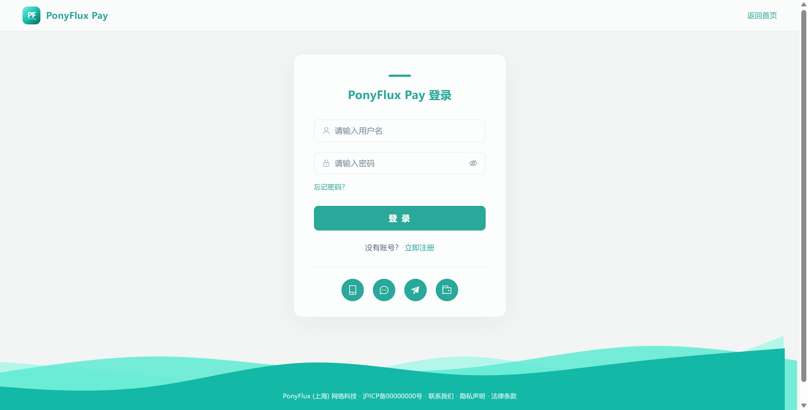
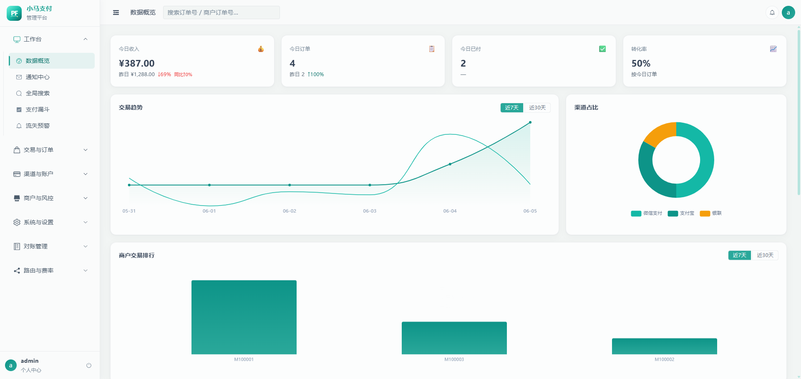
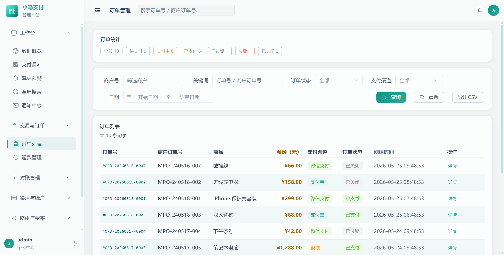
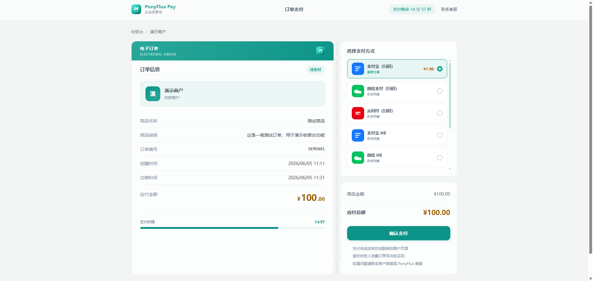
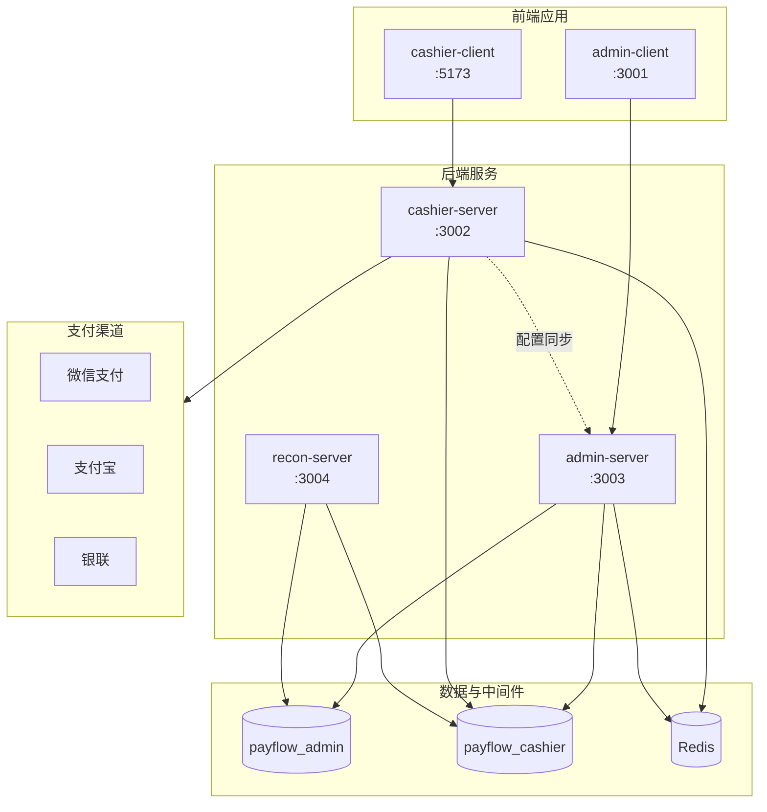

# PonyFlux Pay

> 轻量级支付网关与运营平台 —— 覆盖商户接入、渠道路由、收银台、退款与对账的完整支付链路。

[]()
[]()
[]()
[]()

---

## 界面预览

本地启动后，可通过以下地址体验完整流程。截图均为演示环境真实界面。

### 运管后台（admin-client · :3001）

运营人员在此完成商户管理、渠道配置、订单查询、对账差异处理与 RBAC 权限控制。

| 登录页 | 运营主页 | 订单管理 |
|:---:|:---:|:---:|
|  |  |  |
| JWT 登录 + 验证码防刷 | 交易概览、商户排行、流失预警 | 多条件筛选、状态追踪、退款入口 |

演示账号：`admin` / `admin123`（需先执行一键初始化，见下方「快速启动」）。

### 收银台（cashier-client · :5173）

面向付款用户的支付页面，支持 PC / H5 自适应布局，以及简体中文、繁体中文、英文三语展示。

<p align="center">
  
</p>

<p align="center">
  <sub>演示地址：<code>http://localhost:5173/cashier/pc/demo</code> · 繁体可通过 <code>?lang=zh-TW</code> 或下单时指定 <code>language</code> 字段</sub>
</p>

---

## 核心能力

| 能力 | 说明 |
|------|------|
| **多渠道支付** | 微信（Native / H5 / App / JSAPI 等）、支付宝、银联；Strategy Pattern 插件化，新增渠道只需实现 `PayStrategy` |
| **智能路由** | 按商户、金额、渠道权重自动选择 `PayChannelAccount`，支持 failover 与费率策略 |
| **双库架构** | `payflow_admin` 承载配置与运营数据；`payflow_cashier` 承载交易流水，读写职责分离 |
| **三语收银台** | 订单页由 `language` / `displayLanguage` 驱动文案；门户页支持 `LocaleSwitcher` 切换 |
| **退款闭环** | 申请 → 审批 → 渠道退款 → 商户回调，状态机详见 `docs/REFUND_STATE_MACHINE.md` |
| **对账引擎** | 独立 `recon-server`：账单下载 → 解析 → 比对 → 差异标注；运营侧在 admin 处理工单 |
| **安全体系** | Admin JWT、商户 HMAC-SHA256 签名、支付幂等锁、商户数据隔离、敏感字段 AES-256-GCM 加密 |

---

## 技术栈

| 层级 | 技术选型 |
|------|----------|
| **后端** | Java 17 · Spring Boot 3.2 · MyBatis-Plus · Redis · RocketMQ · XXL-Job |
| **前端** | Vue 3.4 · TypeScript · Vite 5 · TailwindCSS · Element Plus · Pinia · Vue I18n |
| **数据** | MySQL 8 · Redis 7 |
| **构建** | Maven 多模块 · npm · Playwright E2E |

---

## 系统架构



### 支付路由流程

```
商户请求支付
  → PaymentServiceImpl
  → PayChannelService.routeToAccount()   # 选择渠道账户
  → PayStrategyLocator                   # 解析策略 Bean
  → 渠道 Handler（WxPayNativeHandler 等）
  → 渠道网关
```

### 模块一览

| 模块 | 职责 |
|------|------|
| `payflow-common` | 公共组件：`BizException`、AES 加解密、Redis 常量 |
| `payflow-payment-core` | 支付 SPI：`PayStrategy`、`PayMethod`、统一 DTO |
| `payflow-payment-channels/*` | 各渠道实现（微信 / 支付宝 / 银联） |
| `payflow-cashier-server` | 商户侧：下单、支付、退款、异步回调 |
| `payflow-admin-server` | 运营侧：配置、报表、对账 UI、RBAC |
| `payflow-recon-server` | 对账批处理引擎（无管理 UI API） |
| `payflow-sdk-java` | 商户接入 HMAC-SHA256 签名 SDK |
| `payflow-admin-client` | 管理后台 SPA |
| `payflow-cashier-client` | 收银台 / 商户门户 SPA |

---

## 快速启动

### 环境要求

| 依赖 | 版本 |
|------|------|
| Python | 3.9+（一键初始化脚本） |
| JDK | 17+ |
| Maven | 3.8+ |
| Node.js | 18+（前端 dev） |
| MySQL | 8.x（`127.0.0.1:3306`，默认 `root` / `root`） |
| Redis | 7.x |

### ① 一键初始化（推荐）

先确保 **MySQL 已启动**，然后在项目根目录执行：

```powershell
# Windows
.\setup.ps1

# Linux / macOS
./setup.sh

# 仅安装数据库（跳过 Maven / npm 构建）
python scripts/setup.py --db-only
```

脚本将自动完成：

1. 检测 Python / JDK / Maven / Node 环境
2. 尝试启动本地 Redis（Windows 常见路径：`D:\apps\Redis\redis-server.exe`）
3. **重置并安装**演示库（schema + seed）
4. 校验表前缀与 `admin` 账号密码
5. 执行 Maven / npm 依赖安装

### ② 启动服务

各开一个终端：

```bash
# 管理后端
mvn -B -pl payflow-admin-server "-Dmaven.test.skip=true" spring-boot:run

# 收银台后端
mvn -B -pl payflow-cashier-server spring-boot:run

# 管理前端
cd payflow-admin-client && npm run dev

# 收银台前端
cd payflow-cashier-client && npm run dev
```

### ③ 访问入口

| 入口 | 地址 | 说明 |
|------|------|------|
| 管理后台 | http://localhost:3001 | `admin` / `admin123` |
| 收银台演示 | http://localhost:5173/cashier/pc/demo | 无需登录，直接体验支付页 |
| 商户门户 | http://localhost:5173/login | 支持简 / 繁 / 英语言切换 |
| Cashier API | http://localhost:3002 | 商户 HMAC 签名接口 |
| Admin API | http://localhost:3003 | JWT 保护 |
| Recon 引擎 | http://localhost:3004 | 内部对账批处理 |

---

## 端口一览

| 服务 | 端口 |
|------|------|
| payflow-cashier-server | 3002 |
| payflow-admin-server | 3003 |
| payflow-recon-server | 3004 |
| payflow-admin-client（dev） | 3001 |
| payflow-cashier-client（dev） | 5173 |

---

## 常用命令

```bash
# 全量构建（含测试）
mvn -B clean package

# 单模块编译
mvn -B -pl payflow-common compile

# 重置演示库
python scripts/setup.py --db-only

# 前端 E2E 测试
cd payflow-cashier-client && npx playwright test
cd payflow-admin-client && npx playwright test
```

---

## 文档索引

| 文档 | 内容 |
|------|------|
| [docs/CONTRACT_MATRIX.md](docs/CONTRACT_MATRIX.md) | 前后端 API 契约矩阵 |
| [docs/reconciliation.md](docs/reconciliation.md) | 对账架构、表结构与批处理流程 |
| [docs/REFUND_STATE_MACHINE.md](docs/REFUND_STATE_MACHINE.md) | 退款状态机与审批流程 |
| [sql/schema/](sql/schema/) | 数据库 DDL |
| [sql/migrations/](sql/migrations/) | 增量迁移脚本 |
| [CLAUDE.md](CLAUDE.md) | 开发约定、模块地图与构建命令 |

---

## 目录结构

```
PonyFlux-Pay/
├── payflow-common/              # 公共库
├── payflow-payment-core/        # 支付 SPI 与 DTO
├── payflow-payment-channels/    # 微信 / 支付宝 / 银联渠道实现
├── payflow-cashier-server/      # 收银台后端（:3002）
├── payflow-admin-server/        # 管理后端（:3003）
├── payflow-recon-server/        # 对账引擎（:3004）
├── payflow-admin-client/        # 管理前端（:3001）
├── payflow-cashier-client/      # 收银台前端（:5173）
├── payflow-sdk-java/            # 商户接入 SDK
├── sql/                         # Schema · Seed · Migrations
├── setup.ps1 / setup.sh         # 一键初始化入口
├── scripts/setup.py             # 初始化实现（DB + 校验 + 构建）
├── docs/                        # 设计文档与界面截图
└── specs/                       # 功能规格（Spec Kit）
```

---

## 贡献

欢迎提交 Issue 与 Pull Request。较大功能变更建议先在 `specs/` 下补充规格说明，再按 Spec Kit 流程实现。
