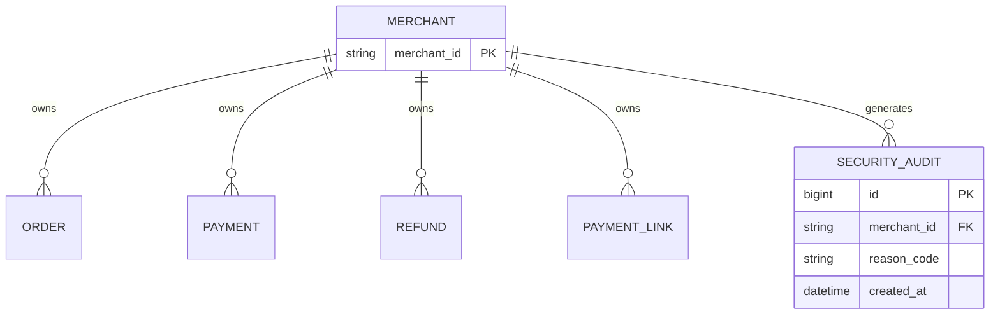

# 数据模型：商户数据隔离与安全审计

**Feature**: 006-merchant-isolation  
**Date**: 2026-05-18

## 实体变更概览

| 实体 | 变更类型 | 所属模块 | 数据库 | 说明 |
|------|----------|----------|--------|------|
| `SecurityAudit` | **新增** | cashier-server（写）/ admin-server（读） | `payflow_cashier` | 越权拒绝审计日志 |
| `MerchantContext` | **新增（内存）** | cashier-server | — | 请求级 ThreadLocal，非持久化 |
| 既有业务表 | **无 DDL 变更** | cashier-server | `payflow_cashier` | 通过拦截器强制 `merchant_id` 隔离 |

## 1. SecurityAudit（`cashier_security_audit`）

### 表结构（Flyway V4）

```sql
CREATE TABLE cashier_security_audit (
    id              BIGINT       NOT NULL AUTO_INCREMENT COMMENT '主键',
    merchant_id     VARCHAR(64)  NOT NULL COMMENT '调用方商户号（JWT/HMAC 上下文）',
    target_merchant_id VARCHAR(64) NULL COMMENT '请求体中声称的商户号（若有）',
    auth_mode       VARCHAR(16)  NOT NULL COMMENT 'JWT/HMAC/INTERNAL',
    http_method     VARCHAR(10)  NOT NULL COMMENT 'HTTP 方法',
    request_path    VARCHAR(512) NOT NULL COMMENT '请求路径',
    resource_type   VARCHAR(32)  NULL COMMENT 'ORDER/PAYMENT/REFUND/LINK 等',
    resource_id     VARCHAR(64)  NULL COMMENT '路径或体中的资源 ID',
    client_ip       VARCHAR(64)  NULL COMMENT '客户端 IP',
    user_agent      VARCHAR(512) NULL COMMENT 'User-Agent（截断）',
    outcome         VARCHAR(16)  NOT NULL COMMENT 'DENIED',
    reason_code     VARCHAR(16)  NOT NULL COMMENT '5101/5102/5103',
    reason_detail   VARCHAR(512) NULL COMMENT '内部原因描述（不返回客户端）',
    created_at      DATETIME(3)  NOT NULL DEFAULT CURRENT_TIMESTAMP(3) COMMENT '发生时间',
    PRIMARY KEY (id),
    KEY idx_merchant_created (merchant_id, created_at),
    KEY idx_outcome_created (outcome, created_at),
    KEY idx_reason_created (reason_code, created_at)
) ENGINE=InnoDB DEFAULT CHARSET=utf8mb4 COMMENT='商户安全审计（越权拒绝）';
```

### 字段说明

| 字段 | 类型 | 必填 | 说明 |
|------|------|------|------|
| `merchant_id` | VARCHAR(64) | 是 | 认证上下文中的商户号 |
| `target_merchant_id` | VARCHAR(64) | 否 | FR-002 场景：请求体冒用的 merchantId |
| `auth_mode` | VARCHAR(16) | 是 | `JWT` / `HMAC` / `INTERNAL` |
| `outcome` | VARCHAR(16) | 是 | 本表仅写入 `DENIED`（预留扩展） |
| `reason_code` | VARCHAR(16) | 是 | `5101` 身份不匹配；`5103` 资源越权（对外仍 5102） |

### 保留策略

- 在线保留 ≥180 天（FR-012）
- 归档任务不在本 Phase 实现，预留 XXL-Job

### Java 实体（cashier-server）

```java
@Data
@TableName("cashier_security_audit")
public class SecurityAuditEntity {
    @TableId(type = IdType.AUTO)
    private Long id;
    private String merchantId;
    private String targetMerchantId;
    private String authMode;
    private String httpMethod;
    private String requestPath;
    private String resourceType;
    private String resourceId;
    private String clientIp;
    private String userAgent;
    private String outcome;
    private String reasonCode;
    private String reasonDetail;
    private LocalDateTime createdAt;
}
```

admin-server 在 `com.payflow.admin.entity.cashier` 包下放置只读同名实体（或 DTO），Mapper 使用 cashier 数据源。

## 2. MerchantContext（请求上下文，非表）

| 属性 | 类型 | 说明 |
|------|------|------|
| `merchantId` | String | 可信商户号 |
| `authMode` | enum | JWT, HMAC, INTERNAL |
| `requestPath` | String | 当前 URI |
| `clientIp` | String | 客户端 IP |

**生命周期**: `MerchantContextInterceptor.preHandle` 设置 → `afterCompletion` 清除。

**禁止**: 业务代码修改 `merchantId`；仅 `MerchantScopeHolder` 可在受控场景切换系统模式。

## 3. 受保护业务表（无 DDL 变更）

以下表必须存在 `merchant_id` 列（VARCHAR），纳入 `MerchantScopeInnerInterceptor`：

| 表名 | 主键业务列 | 备注 |
|------|------------|------|
| `cashier_orders` | `order_id` | 订单 |
| `cashier_payments` | `payment_id` | 支付 |
| `cashier_refunds` | `refund_id` | 退款 |
| `cashier_payment_link` | `link_id` | Payment Link |
| `cashier_webhook_endpoint` | 待确认 | 若表存在则纳入 |
| `cashier_webhook_delivery` | 待确认 | 若表存在则纳入 |

实施时需对照 `V1__baseline.sql` 确认 webhook 相关表名与列名。

## 4. 错误码（5xxx 商户段扩展）

| 码 | HTTP | 对外 message | 审计 reason_code |
|----|------|--------------|------------------|
| 5101 | 403 | 商户身份与请求不匹配 | 5101 |
| 5102 | 404 | 请求的资源不存在 | 5102 或 5103 |
| 5103 | — | （不返回客户端） | 5103 |

在 `payflow-cashier-server` 的 `GlobalExceptionHandler` 中映射 `BizException` → HTTP 状态码。

## 5. 管理端查询 DTO（admin-server）

### SecurityAuditQueryRequest（查询参数）

| 参数 | 类型 | 说明 |
|------|------|------|
| `merchantId` | String | 可选筛选 |
| `outcome` | String | 默认 DENIED |
| `reasonCode` | String | 可选 |
| `requestPath` | String | 可选，模糊 |
| `startTime` | LocalDateTime | 必填其一 |
| `endTime` | LocalDateTime | 必填其一 |
| `page` | int | 默认 1 |
| `pageSize` | int | 默认 20，最大 100 |

### SecurityAuditVO（响应行）

与实体字段一致，**不包含** `reason_detail` 中的敏感拼接；`user_agent` 可截断至 128 字符展示。

## 6. 状态与关系



审计记录与商户为逻辑关联，**不设外键**（审计表只增，避免商户删除影响历史）。
