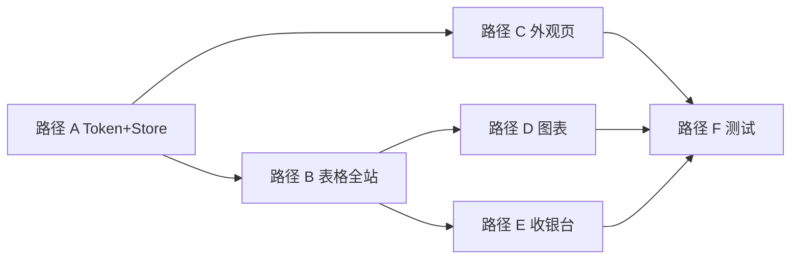

# Implementation Plan: 双端统一主题与 UI 体验优化

**Branch**: `009-dual-theme-ui` | **Date**: 2026-05-22 | **Spec**: [spec.md](./spec.md)  
**Input**: Feature specification from `/specs/009-dual-theme-ui/spec.md`

**Note**: 本计划由 `/speckit-plan` 命令填充。

## Summary

在**不改变后端 API** 的前提下，统一 **payflow-admin-client** 与 **payflow-cashier-client** 的视觉性格：清新族（mint/ocean/violet）自然柔和，暗夜（dark）对比更强；**表格为最高优先级**，通过全局 `.data-table` 契约、主题化斑马纹（清新轻/暗夜略强）及用户可选的**标准/紧凑**密度实现全站一致。管理端新增「外观与显示」偏好页（主题 + 表格密度），顶栏保留快速换肤；收银台对齐品牌 Token 与暗夜可读性。

## Technical Context

**Language/Version**: TypeScript 5.x / Vue 3.4  
**Primary Dependencies**: Vite 5、Element Plus、Pinia 2.1、TailwindCSS 3.4、ECharts 5.5（管理端）  
**Storage**: 浏览器 `localStorage`（`adminTheme`、`adminTableDensity`）  
**Testing**: Playwright（admin-client / cashier-client 按需）、人工表格路由走查清单  
**Target Platform**: Web Browser（Chrome/Edge 最新两个主版本）  
**Project Type**: web-app（双前端，无后端变更）  
**Performance Goals**: 主题/密度切换后 1s 内可见区域完成样式更新（SC-002/008/009）  
**Constraints**: 不新增 Maven 模块；不改变 `{ code, message, data }` API；表格正文字号不随紧凑模式缩小；暗夜表格 AA 对比度（FR-018/SC-010）  
**Scale/Scope**: 管理端 25+ 含表页面、4 主题 × 2 密度、收银台支付主流程页

## Constitution Check

*GATE: Phase 0 研究前 — 全部 PASS*

| # | 宪法原则 | 状态 | 说明 |
|---|----------|------|------|
| 1 | I. 模块边界纪律 | PASS | 仅改 `payflow-admin-client`、`payflow-cashier-client` |
| 2 | II. 支付渠道抽象 | N/A | 不涉及支付逻辑 |
| 3 | III. 数据库分区 | N/A | 无表结构变更 |
| 4 | IV. API 响应规范 | N/A | 无新 API |
| 5 | V. 密钥与配置安全 | PASS | 仅本地 UI 偏好，无密钥 |
| 6 | 编码规范 | PASS | TS/Vue 命名与现有 stores、styles 一致 |
| 7 | 数据库访问 | N/A | |
| 8 | 安全编码 | PASS | 无敏感数据展示变更 |
| 9 | 测试规范 | PASS | quickstart 含 Playwright + 表格走查 |

**Gate Result**: ALL PASS

## Project Structure

### Documentation (this feature)

```text
specs/009-dual-theme-ui/
├── plan.md              # 本文件
├── research.md          # Phase 0
├── data-model.md        # Phase 1
├── quickstart.md        # Phase 1 验收
├── contracts/
│   └── ui-theme-contract.md
└── tasks.md             # /speckit-tasks 输出
```

### Source Code（本特性涉及）

```text
payflow-admin-client/
├── src/stores/theme.ts              # 已有：扩展 init 协同密度
├── src/stores/tableDensity.ts       # 新增：标准/紧凑偏好
├── src/styles/themes.css            # 扩展：stripe strong、密度变量
├── src/styles/dark-theme-overrides.css
├── src/styles/light-theme-soft.css
├── src/style.css                    # .data-table 规范 + compact 变体
├── src/pages/admin/preferences.vue  # 新增：外观与显示
├── src/pages/admin/layout.vue       # 顶栏/菜单入口
├── src/router/index.ts              # 注册 preferences 路由
├── src/utils/chartTheme.ts          # 按 theme key 分色
└── src/pages/admin/**/*.vue         # 表格 class/stripe/硬编码色清理

payflow-cashier-client/
├── src/styles/main.css              # 或新增 brand-tokens.css
└── src/pages/cashier/**/*.vue       # 品牌色与暗夜对比
```

**Structure Decision**: 不新增顶层模块；表格逻辑以**全局 CSS + Store** 为主，避免本期引入 `PfDataTable` 大包 refactor。

## Complexity Tracking

> 无宪法豁免。

| Violation | Why Needed | Simpler Alternative Rejected Because |
|-----------|------------|-------------------------------------|

## Phase 0: Research

已完成：[research.md](./research.md)

关键决策：
- 延续 `data-theme` + CSS 变量，新增 `data-table-density`。
- 表格密度与主题正交，Pinia + localStorage。
- 斑马纹按主题分档（清新轻 / 暗夜略强），禁止深色吞字。
- 外观偏好独立页，不与 `settings.vue` 系统配置混淆。
- 图表按 theme key 适配，不仅 dark 二分。
- 收银台 Token 子集对齐，不要求四主题 UI。

## Phase 1: Design & Contracts

已完成：
- [data-model.md](./data-model.md) — Theme、TableDensity、DesignToken、TableStyleContract、本地偏好状态机。
- [contracts/ui-theme-contract.md](./contracts/ui-theme-contract.md) — 文档属性、表格标记、密度、外观页、收银台子集、验收清单。
- [quickstart.md](./quickstart.md) — 表格走查、主题/密度、持久化、Playwright 路径。

## Post-Design Constitution Check

| # | 宪法原则 | 状态 | 说明 |
|---|----------|------|------|
| 1~9 | （同前） | PASS | 设计未引入后端或模块越界 |

**Gate Result**: ALL PASS

## Phase 2: Implementation Path（实现路径）

以下顺序供 `/speckit-tasks` 拆分为可执行任务；**表格相关任务优先于**收银台与图表。

### 路径 A — 设计令牌与表格基础（P1，阻塞项）

| 步骤 | 内容 | 关键文件 |
|------|------|----------|
| A1 | 在 `themes.css` 为 mint/ocean/violet/dark 增加 `--pf-table-stripe`、`--pf-table-stripe-strong`、`--pf-table-cell-py`（及 compact 变体） | `themes.css` |
| A2 | 在 `style.css` 扩展 `.data-table`：密度选择器 `[data-table-density='compact']`、斑马纹引用新 Token、悬停不透明规则保持 | `style.css` |
| A3 | 审计 `dark-theme-overrides.css` 中表格/表单规则，消除与 Token 冲突的硬编码 | `dark-theme-overrides.css` |
| A4 | 新增 `useTableDensityStore`：`standard`/`compact`、`apply()` 设置 `document.documentElement.dataset.tableDensity` | `stores/tableDensity.ts` |
| A5 | `App.vue` 或 `main.ts` 启动时 `themeStore.init()` + `tableDensityStore.init()` | `App.vue` |

### 路径 B — 表格全站统一（P1，重中之重）

| 步骤 | 内容 | 关键文件 |
|------|------|----------|
| B1 | 扫描所有 `el-table`：缺 `data-table` / `stripe` 的页面补齐 | `src/pages/admin/**/*.vue` |
| B2 | 清除表格区域内 Tailwind 硬编码色（如 `text-blue-600`）改用语义类或 Token | 同上 |
| B3 | 统一分页、空态、loading 在 `.page-table-shell` 下的主题色 | `style.css` |
| B4 | 跑通 [quickstart.md](./quickstart.md) 表格 12 路由清单 | — |
| B5 | 暗夜对比度抽检：订单/对账/审计页金额列、状态 tag、操作按钮（SC-010） | — |

### 路径 C — 外观偏好 UI（P1）

| 步骤 | 内容 | 关键文件 |
|------|------|----------|
| C1 | 新增 `preferences.vue`：主题四选一 + 表格密度二选一 + 简要说明 | `pages/admin/preferences.vue` |
| C2 | 路由与侧栏/菜单项「外观与显示」（可挂系统管理下） | `router/index.ts`、菜单种子（若需） |
| C3 | 与顶栏 `onThemeCommand` 共用 store，避免双源状态 | `layout.vue` |

### 路径 D — 主题全局与图表（P1/P2）

| 步骤 | 内容 | 关键文件 |
|------|------|----------|
| D1 | `chartTheme.ts` 按 `mint|ocean|violet|dark` 返回 ChartThemeColors | `chartTheme.ts` |
| D2 | `dashboard.vue` 等监听 theme 变化并 `chart.setOption` 刷新 | `dashboard.vue` |
| D3 | 登录页、侧栏、弹窗漏色扫描（FR-001/002） | `login/`、`layout.vue` |

### 路径 E — 收银台对齐（P1）

| 步骤 | 内容 | 关键文件 |
|------|------|----------|
| E1 | 抽取或复制清新/暗夜核心 Token 至收银台 | `cashier-client/src/styles/` |
| E2 | 收银台头部、金额区、支付按钮、结果页与管理端 mint/dark 同源 | `pages/cashier/**` |
| E3 | 移动端 390px 走查（SC-005） | — |

### 路径 F — 测试与收尾（P2/P3）

| 步骤 | 内容 |
|------|------|
| F1 | 管理端 Playwright：主题切换、密度切换、订单列表表格可见性 |
| F2 | 可选：添加 `theme-table.spec.ts` 覆盖 preferences 持久化 |
| F3 | 执行 quickstart 全路径，记录 SC-001~010 证据 |
| F4 | 更新 `docs/CONTRACT_MATRIX.md` 仅当新增路由需文档化（preferences 页面） |



## Phase 2: Planning Handoff

下一阶段 **`/speckit-tasks`** 建议按路径 A→B→C→D→E→F 生成任务，并标注：
- **P1 阻塞**: A、B、C
- **P1 并行（B 完成后）**: D、E
- **P2**: F

预估工作量（供 tasks 参考）：
- 路径 A+C：~1–2 人日
- 路径 B（表格扫页）：~2–3 人日（取决于存量硬编码）
- 路径 D+E：~1–2 人日
- 路径 F：~0.5–1 人日

## 风险与缓解

| 风险 | 缓解 |
|------|------|
| 部分页面未挂 `data-table` | B1 全量 grep + `patch-admin-tables.mjs` 辅助 |
| 暗夜斑马纹导致对比不足 | FR-018 走查 + 调低 `--pf-table-stripe-strong` 饱和度 |
| 紧凑模式挤压行内 tag | TSC-06：行内组件 `size="small"` + max-height |
| 图表不随 ocean/violet 更新 | D1/D2 按 theme key 分支 |
