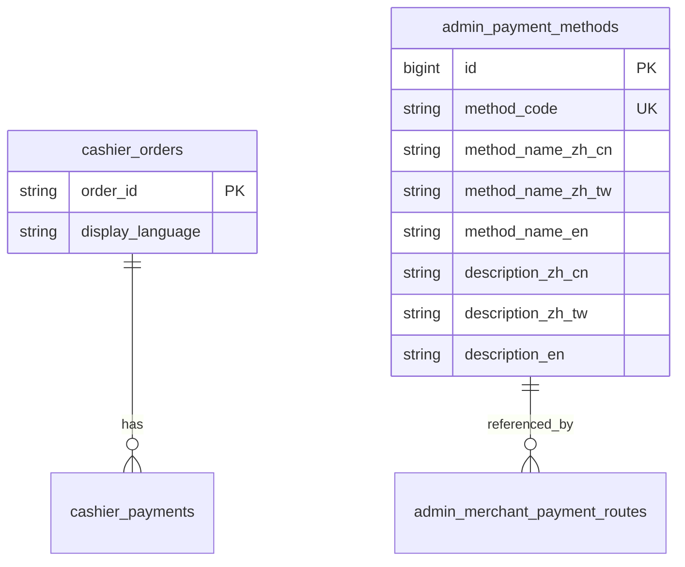

# Data Model: 收银台国际化（015-cashier-i18n）

**Date**: 2026-06-03

## 1. 受支持语言（逻辑枚举）

| 标识 | 说明 | HTML lang |
|------|------|-----------|
| `zh-CN` | 简体中文（默认） | `zh-CN` |
| `zh-TW` | 繁体中文（台湾常用） | `zh-TW` |
| `en-US` | 英文 | `en` |

**校验规则**:
- 下单 `language`：可选；缺失或非法 → 规范化为 `zh-CN`。
- 后台支付方式保存：三语展示名与三语描述均非空且 trim 后长度 > 0。

---

## 2. `cashier_orders`（库：`payflow_cashier`）

### 新增字段

| 列名 | 类型 | 默认 | 说明 |
|------|------|------|------|
| `display_language` | `VARCHAR(16) NOT NULL` | `'zh-CN'` | 收银台/收据展示语言，下单时写入 |

### 实体映射

- Java: `Order.displayLanguage` → `@TableField("display_language")`
- 写入时机: `OrderServiceImpl.createOrder`
- 读出时机: `OrderServiceImpl.getCashierInfo` → `CashierResponse.displayLanguage`

### 状态

订单状态机不变；`display_language` 创建后不可变（本期无改单语言需求）。

---

## 3. `admin_payment_methods`（库：`payflow_admin`）

### 新增字段

| 列名 | 类型 | 约束 | 说明 |
|------|------|------|------|
| `method_name_zh_cn` | `VARCHAR(128) NOT NULL` | | 展示名-简体 |
| `method_name_zh_tw` | `VARCHAR(128) NOT NULL` | | 展示名-繁体 |
| `method_name_en` | `VARCHAR(128) NOT NULL` | | 展示名-英文 |
| `description_zh_cn` | `VARCHAR(512) NOT NULL` | | 描述-简体 |
| `description_zh_tw` | `VARCHAR(512) NOT NULL` | | 描述-繁体 |
| `description_en` | `VARCHAR(512) NOT NULL` | | 描述-英文 |

### 遗留字段

| 列名 | 处理 |
|------|------|
| `method_name` | 迁移期：写入时同步为 `method_name_zh_cn`；列表/内部接口逐步改用多语言列 |
| `description` | 同步为 `description_zh_cn` |

### 实体 `PaymentMethod` 扩展

```text
methodNameZhCn, methodNameZhTw, methodNameEn
descriptionZhCn, descriptionZhTw, descriptionEn
```

MyBatis-Plus `@TableField` 映射 snake_case 列名。

### 校验（服务层）

`PaymentMethodService.validateLocalizedFields(PaymentMethod m)`:
- 六字段均 `StringUtils.hasText`
- 否则 `BizException`（admin 错误码段，建议 4xxx 配置类）

---

## 4. API 载荷（非持久化）

### `CreateOrderRequest`

| 字段 | 类型 | 必填 | 说明 |
|------|------|------|------|
| `language` | string | 否 | 展示语言，白名单 `zh-CN`/`zh-TW`/`en-US` |

### `CashierResponse`

| 字段 | 类型 | 说明 |
|------|------|------|
| `displayLanguage` | string | 订单展示语言 |

### `PaymentMethodDTO`（收银台）

| 字段 | 类型 | 说明 |
|------|------|------|
| `code` | string | 方式编码 |
| `name` | string | **已按 locale 解析**的展示名 |
| `description` | string | **已按 locale 解析**的描述 |

### 内部接口 `GET /api/v1/internal/cashier/payment-methods`

| Query | 类型 | 必填 | 说明 |
|-------|------|------|------|
| `merchantId` | string | 是 | 商户号 |
| `orderChannel` | string | 是 | 订单渠道 |
| `locale` | string | 否 | 默认 `zh-CN` |

响应 `data[]` 每项 `methodName` / `description` 为解析后的单语言字符串。

---

## 5. 前端类型扩展

### `payflow-cashier-client` — `CashierInfo`

```ts
displayLanguage?: 'zh-CN' | 'zh-TW' | 'en-US'
```

### `payflow-admin-client` — `PaymentMethod`

```ts
methodNameZhCn: string
methodNameZhTw: string
methodNameEn: string
descriptionZhCn: string
descriptionZhTw: string
descriptionEn: string
// methodName 可选保留只读展示（列表默认显示简体）
```

---

## 6. 关系图



---

## 7. 不在本期数据范围

- `cashier_channels` 渠道名称多语言
- 商户名称、订单 `subject`/`body` 多语言（仍由商户下单时提供单语言文本）
- `payflow_admin` 其它配置表
